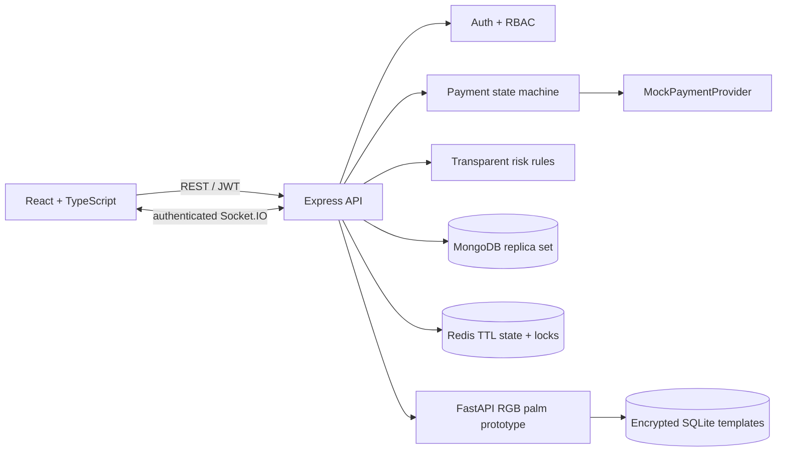

# Nepal Hand Pay

Nepal Hand Pay is a full-stack fintech portfolio prototype for cardless checkout using an ordinary RGB camera, a simulated NPR wallet, and risk-based customer confirmation. It includes customer, merchant, administrator, and read-only auditor workspaces connected to real API, MongoDB, Redis, WebSocket, and Python recognition-service paths.

> **This is an educational/portfolio biometric prototype. RGB webcam palm recognition is not equivalent to commercial infrared palm-vein technology and should not be used as real financial biometric authentication without certified hardware, security review, regulatory compliance, and production-grade biometric technology.**

No real bank settlement occurs. Every wallet/provider response is clearly marked as mock data.

## Architecture



See [architecture](docs/architecture.md), [payment flow](docs/payment-flow.md), [palm authentication](docs/palm-authentication.md), [security](docs/security.md), [scalability](docs/scalability.md), [test matrix](docs/test-matrix.md), [API](docs/api.md), [performance](docs/performance.md), and [deployment](docs/deployment.md).

## Features

- Secure registration/login, bcrypt password and payment-PIN hashing, rotating refresh tokens, access-token revocation, lockouts, and role-based routes.
- Payment lifecycle with explicit transitions, request/processing idempotency, atomic wallet movement, distributed locks, status polling, and realtime updates.
- Provider boundary with a clearly labeled `MockPaymentProvider`; no fake bank success is represented.
- Multiple-sample palm enrollment, ROI extraction, normalization, quality checks, bounded candidate retrieval before exact verification, duplicate detection, configurable matching, encrypted versioned templates, deletion, retry lockout, and explicitly limited passive RGB checks.
- Explainable LOW/MEDIUM/HIGH/BLOCKED rules and PIN/OTP step-up. Development OTPs are returned only outside production.
- Full/partial atomic refunds with replay protection.
- Customer wallet/history/security views; merchant POS/history/refunds; admin metrics/configuration; auditor read-only transactions, risk events, and audit trail.
- Structured logs, request IDs, append-only application audit model, health/readiness endpoints, Docker health checks, and CI.

## Repository

```text
apps/
  api/                     Express, MongoDB, Redis, Socket.IO
  web/                     React, TypeScript, Vite, Tailwind
packages/
  shared-types/            Cross-workspace payment and role types
services/
  palm-recognition/        FastAPI, OpenCV, encrypted SQLite templates
docs/                      Architecture and operational documentation
postman/                   Stateful API collection and local environment
tests/load/                Safe k6 read/create scenarios
scripts/                   Cross-platform development helpers
```

## Local setup

Requirements: Node.js 20+, npm 10+, Python 3.11+, MongoDB (replica set for transactions), and Redis. NumPy and Pydantic are pinned per Python compatibility range so Python 3.14 installations receive compatible wheels rather than unsupported source builds.

```bash
cp .env.example .env
npm install
python -m venv .venv
.venv/bin/python -m pip install -r services/palm-recognition/requirements.txt
npm run typecheck
npm test
npm run test:palm
npm run dev
```

Run `npm run seed` after MongoDB starts. The seed command prints generated development credentials unless `DEMO_SEED_PASSWORD` is set. Never use demo credentials outside local development.

On Windows systems that block `npm.ps1`, use `npm.cmd` for the same commands.
On Windows, the virtual-environment install command is `.venv\Scripts\python.exe -m pip install -r services/palm-recognition/requirements.txt`. Root palm scripts automatically prefer this local environment.

## Docker startup

Copy `.env.example` to `.env`, replace all secrets, and create a Fernet key:

```bash
python -c "from cryptography.fernet import Fernet; print(Fernet.generate_key().decode())"
docker compose up --build
```

Open the frontend at `http://localhost:8080`. The API is at `http://localhost:4000`; readiness is `GET /health/ready`.

Docker intentionally refuses production-mode startup when JWT, service, or biometric-encryption secrets are missing.

## Important environment variables

| Variable | Purpose |
|---|---|
| `MONGODB_URI` | MongoDB connection; payments need replica-set transactions |
| `REDIS_URL`, `REDIS_REQUIRED` | TTL state, rate limits, OTPs, revocation, locks |
| `JWT_ACCESS_SECRET`, `JWT_REFRESH_SECRET` | Independent signing secrets, at least 32 characters |
| `PALM_SERVICE_URL`, `PALM_SERVICE_KEY` | Private API-to-palm-service authentication |
| `PALM_TEMPLATE_ENCRYPTION_KEY` | Fernet key for encrypted biometric templates |
| `PALM_MATCH_THRESHOLD`, `PALM_DUPLICATE_THRESHOLD` | Demo matching thresholds |
| `RISK_*_THRESHOLD` | LOW/MEDIUM/HIGH/BLOCKED cutoffs |
| `OTP_TTL_SECONDS`, `PIN_*` | Step-up expiry and brute-force policy |
| `FRONTEND_URL` | Comma-separated CORS allowlist |

All supported variables and safe development defaults are documented in [.env.example](.env.example).

## Main API surface

- `/api/v1/auth/*` — registration, login, refresh, logout, verification, reset.
- `/api/v1/palm/*` — consented enrollment, status, verification, deletion.
- `/api/v1/payments/requests/*` — merchant creation, identify, confirm, cancel, status.
- `/api/v1/transactions/*` — scoped history, detail, report, PDF receipt.
- `/api/v1/merchants/*` — dashboard, merchant profile, idempotent refunds.
- `/api/v1/admin/*` — metrics, user/merchant controls, demo funds, risk configuration.
- `/api/v1/security/*` — scoped events, risk alerts, append-only audit views.

Payment creation, confirmation, refunds, and administrative wallet credits require `Idempotency-Key`. See [API details](docs/api.md).

## Verification

```bash
npm install
npm run typecheck
npm test
npm run build
npm run test:palm
npm run validate:postman
docker compose config
```

With a live seeded stack, run `npm run test:postman`. See [postman/README.md](postman/README.md) for the full biometric flow. Safe k6 scenarios and measured-target guidance are in [tests/load/README.md](tests/load/README.md) and [docs/performance.md](docs/performance.md).

## Limitations and future work

- RGB texture matching has no certified presentation-attack detection and must not authorize real money.
- Production use needs certified infrared palm-vein hardware, independent biometric evaluation, HSM/KMS-backed key management, key rotation, device attestation, and privacy/compliance review.
- Production OTP delivery requires a verified SMS/email provider; local development exposes the code only in the response.
- The mock wallet is not a ledger suitable for regulated funds. A real deployment needs double-entry accounting, reconciliation, settlement, disputes, and a licensed Nepal-compatible provider adapter.
- Automated browser tests and full database integration tests should be expanded against disposable MongoDB/Redis services. The checked-in concurrency tests validate conditional-update behavior with deterministic doubles; they are not a substitute for distributed infrastructure tests.
- No job queue is included yet because the prototype has no external email/SMS delivery. Payment and wallet consistency remain synchronous; add BullMQ workers only when real notification, analytics, or reconciliation workloads exist.
- The local palm candidate index is an in-process LSH demo boundary. Production must use a recall-tested, durable ANN/vector service such as Qdrant, Milvus, pgvector, or FAISS behind a worker/service boundary.
