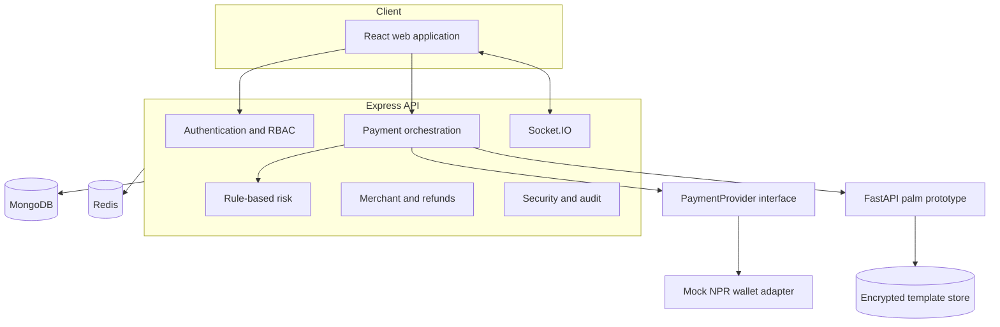
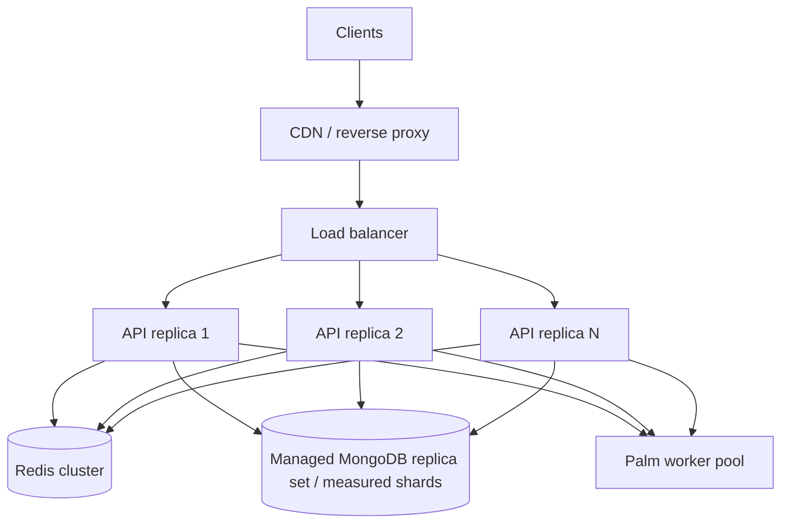

# Architecture

Nepal Hand Pay is a small workspace-oriented modular monolith plus an isolated biometric service. The API is the only authority for identity, risk, payment state, and balances.

Responsibilities are deliberately separated:

- React presents server state and may retry only with stable idempotency keys.
- Express validates input, authenticates roles, owns state transitions, and coordinates atomic work.
- MongoDB stores durable identity, wallet, payment, transaction, risk, and audit records. Wallet transfers require a replica set.
- Redis stores expiring rate counters, OTP hashes, temporary payment/match state, token revocations, and distributed locks. Development can degrade to a process-local fallback; production cannot.
- FastAPI receives short-lived data URLs, extracts features in memory, and stores only encrypted templates.
- `PaymentProvider` prevents orchestration from depending directly on a future bank/provider integration.

The code avoids microservices beyond the biometric boundary because independent deployment and data isolation are useful there; further splitting would add operational cost without improving this portfolio prototype.

## Horizontal scale path

JWT access tokens keep API replicas stateless. Durable state is in MongoDB; revocation, rate counters, OTPs, short-lived sessions, and distributed locks have TTLs in Redis. Socket.IO needs a Redis adapter before multiple realtime replicas are deployed. Sharding, queue workers, and additional service boundaries must be introduced from measured bottlenecks rather than a registered-user count alone.

The in-process expiry scheduler performs only a conditional, bounded cleanup and is safe when multiple replicas run it. When asynchronous delivery, reconciliation, or analytics becomes real, move those non-critical tasks to BullMQ/Redis with retry and dead-letter policies. Wallet debit/credit and authoritative payment state must stay inside the synchronous MongoDB transaction.
