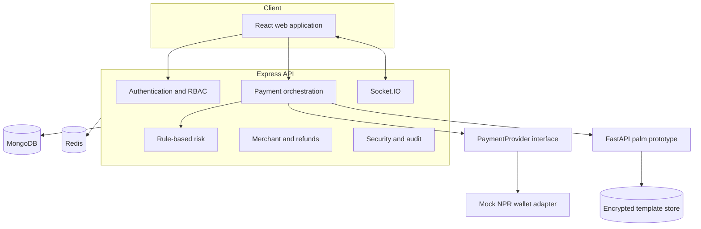

# Architecture

Nepal Hand Pay is a small workspace-oriented modular monolith plus an isolated biometric service. The API is the only authority for identity, risk, payment state, and balances.

Responsibilities are deliberately separated:

- React presents server state and may retry only with stable idempotency keys.
- Express validates input, authenticates roles, owns state transitions, and coordinates atomic work.
- MongoDB stores durable identity, wallet, payment, transaction, risk, and audit records. Wallet transfers require a replica set.
- Redis stores expiring rate counters, OTP hashes, temporary payment/match state, token revocations, and distributed locks. Development can degrade to a process-local fallback; production cannot.
- FastAPI receives short-lived data URLs, extracts features in memory, and stores only encrypted templates.
- `PaymentProvider` prevents orchestration from depending directly on a future bank/provider integration.

The code avoids microservices beyond the biometric boundary because independent deployment and data isolation are useful there; further splitting would add operational cost without improving this portfolio prototype.
