# Prototype palm authentication

```mermaid
flowchart LR
  RGB[RGB camera frames] --> Decode[Type/size validation]
  Decode --> ROI[Palm-like ROI]
  ROI --> Quality[Blur, contrast, exposure checks]
  Quality --> Normalize[Resize, grayscale, CLAHE]
  Normalize --> Features[DCT + gradient features]
  Features --> Aggregate[Median of 3–5 captures]
  Aggregate --> Index[Candidate index]
  Index --> Candidates[Top-N candidates]
  Candidates --> Verify[Exact similarity verification]
  Verify --> Duplicate[Duplicate-enrollment comparison]
  Duplicate --> Encrypt[Fernet-encrypted versioned template]
  Encrypt --> Store[(Template store)]
  RGB -. raw pixels discarded .-> Gone[No raw-image persistence]
```

The service performs educational palm-print-like RGB feature matching. It supports multiple enrollment samples, hand-side metadata, sample consistency, quality rejection, configurable similarity thresholds, duplicate detection, encrypted templates, algorithm versioning, and deletion.

The `PASSIVE_RGB_CHECK_ONLY` result means only obvious quality/replayed-frame checks ran. A normal webcam cannot see subcutaneous veins or reliably distinguish a live palm from a high-quality presentation attack. It is not certified liveness or financial-grade biometric assurance.

Raw images are decoded and processed in memory. The code does not write them to disk or include templates in API responses. The durable API stores only an opaque service reference; the recognition service stores the encrypted feature vector.

## Candidate retrieval and storage boundary

`PalmTemplateRepository` isolates durable template operations behind `save`, `get`, `list`, `delete`, and `status`. The checked-in `SqlitePalmTemplateRepository` encrypts vectors using Fernet and is appropriate only for a local demo. It must be replaced by a horizontally appropriate, encrypted, access-controlled biometric store for production.

`PalmTemplateIndex` isolates candidate retrieval behind `add`, `remove`, and `search`. The local implementation is an in-process locality-sensitive-hash (LSH) index: it retrieves a bounded candidate set, then the service performs exact similarity verification only for those candidates. This removes the request-path SQLite full scan and creates a clean integration point, but it has no production recall/SLA guarantee, is rebuilt on service start, and is deliberately not represented as a million-record solution.

For production, place a measured ANN/vector implementation (for example Qdrant, Milvus, pgvector, or FAISS) behind the same interface. It needs durable indexing, tenant/privacy controls, encryption/key management, recall and false-accept evaluation, monitoring, and a re-enrollment/index migration plan.

Production replacement requirements include infrared vein hardware, device attestation, challenge-response capture, calibrated quality metrics, independent false-accept/false-reject testing, PAD certification, KMS/HSM key custody, rotation/migration support, explicit retention policy, and legal/privacy review.
