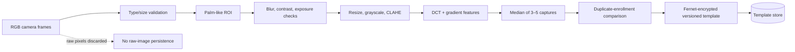

# Prototype palm authentication

The service performs educational palm-print-like RGB feature matching. It supports multiple enrollment samples, hand-side metadata, sample consistency, quality rejection, configurable similarity thresholds, duplicate detection, encrypted templates, algorithm versioning, and deletion.

The `PASSIVE_RGB_CHECK_ONLY` result means only obvious quality/replayed-frame checks ran. A normal webcam cannot see subcutaneous veins or reliably distinguish a live palm from a high-quality presentation attack. It is not certified liveness or financial-grade biometric assurance.

Raw images are decoded and processed in memory. The code does not write them to disk or include templates in API responses. The durable API stores only an opaque service reference; the recognition service stores the encrypted feature vector.

Production replacement requirements include infrared vein hardware, device attestation, challenge-response capture, calibrated quality metrics, independent false-accept/false-reject testing, PAD certification, KMS/HSM key custody, rotation/migration support, explicit retention policy, and legal/privacy review.
