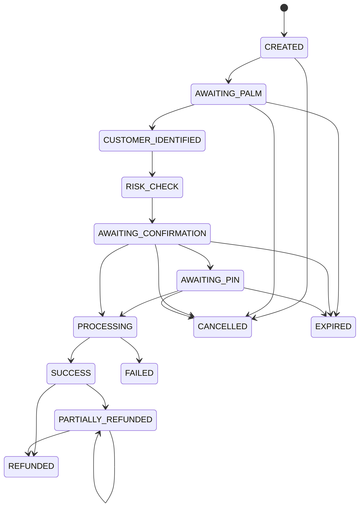

# Payment flow

1. An approved merchant submits amount, optional description/reference, and an `Idempotency-Key`.
2. The API hashes the canonical request. Reuse with identical data returns the original session; reuse with different data is rejected.
3. A palm sample is validated by the Python service. Failed attempts use expiring counters and temporary lockout.
4. A matched active customer and enrollment pass through transparent `RISK_CHECK` rules. BLOCKED requests fail without moving funds.
5. LOW risk requires explicit confirmation; MEDIUM adds `AWAITING_PIN`; HIGH adds PIN and a short-lived OTP hash.
6. Confirmation uses its own idempotency key. Final authorization atomically claims `AWAITING_CONFIRMATION` or `AWAITING_PIN` as `PROCESSING`.
7. A distributed lock and MongoDB transaction conditionally debit the customer, credit the merchant, create one unique transaction, and mark success.
8. The UI receives realtime state but polls the durable server state after a timeout. The frontend never declares success on its own.
9. Refunds use an idempotency key, per-transaction lock, guarded refunded amount, and atomic reverse wallet movement.
10. A bounded, idempotent maintenance task marks abandoned pre-processing requests expired. It never changes a payment already in `PROCESSING`.

The included provider is a mock wallet adapter. It never claims bank settlement and its references start with `mock:`.
